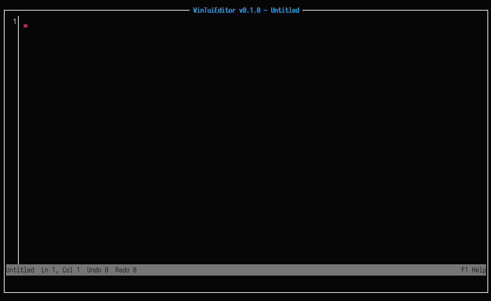
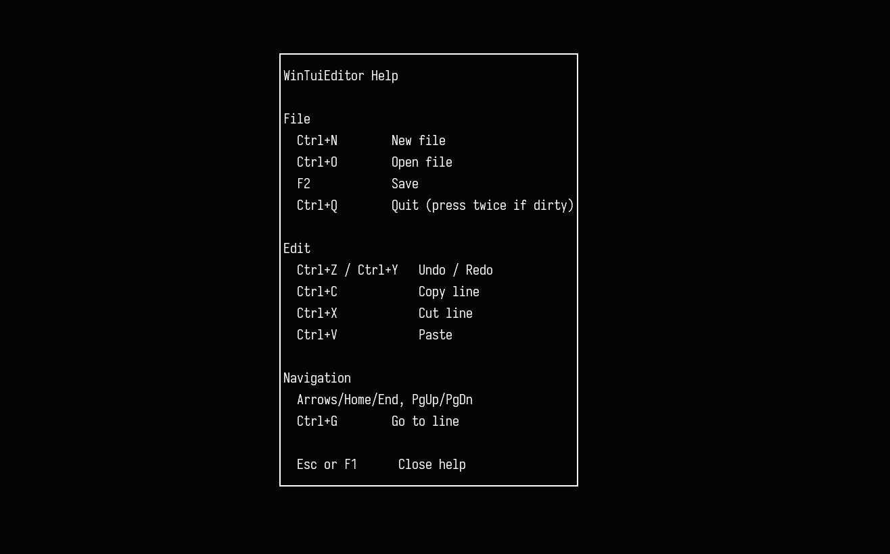

[](LICENSE)
[](https://github.com/dazlab/WinTuiRss/issues)

[](https://github.com/dazlab/WinTuiEditor/actions/workflows/dotnet-desktop.yml)
[](https://github.com/dazlab/WinTuiEditor/actions/workflows/dotnet-desktop.yml?query=branch%3Adevelopment)


## A native Windows terminal UI (TUI) Text Editor built with .NET and [Spectre.Console](https://github.com/spectreconsole/spectre.console)

Windows already has a solid selection of capable text editors. Tools such as [Microsoft Edit](https://github.com/microsoft/edit), [GNU Nano](https://www.nano-editor.org/), and [NeoVim](https://neovim.io/) cover a wide range of use cases, from simple file edits to highly customised workflows. WinTuiEditor is not an attempt to replace any of them.

This project started as an exploration of what could be built on Windows using the Spectre.Console library. After completing the sister project [WinTuiRss](https://github.com/dazlab/WinTuiRss), it became clear that modern terminal user interfaces (TUIs) are both viable and under-represented in native Windows tooling.

WinTuiEditor is part of a broader experiment: building a small, cohesive suite of TUI applications designed specifically for Windows users, without relying on Unix-like environments or compatibility layers. The focus is on clean terminal UI design, keyboard-driven interaction, and leveraging modern .NET libraries to produce fast, native console applications.

The goal is practical experimentation, not reinvention — seeing how far a Windows-first TUI approach can be taken, and what kinds of tools it enables.

## Screenshots
### Main Screen


### Help Menu


## Download

Releases are published on the GitHub **Releases** page.

## Requirements

- For development: .NET 8 SDK
- For running: none if you use the self-contained release build (single EXE)

## Install (from source)

```powershell
git clone https://github.com/dazlab/WinTuiEditor.git
cd WinTuiEditor
dotnet restore
dotnet run
