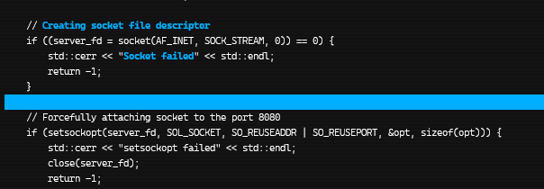
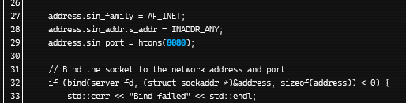
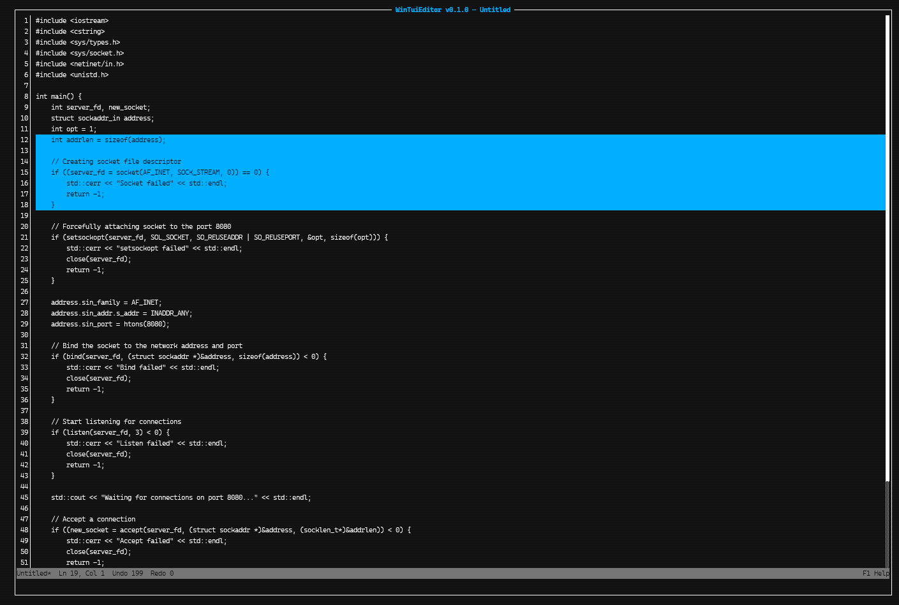

[](LICENSE)
[](https://github.com/dazlab/WinTuiRss/issues)

[](https://github.com/dazlab/WinTuiEditor/actions/workflows/dotnet-desktop.yml)
[](https://github.com/dazlab/WinTuiEditor/actions/workflows/dotnet-desktop.yml?query=branch%3Adevelopment)


## A native Windows terminal UI (TUI) Text Editor built with .NET and [Spectre.Console](https://github.com/spectreconsole/spectre.console)

## Current Branch Diffs
Implemented:
- Theme cycling, along with 7 themes.
- Bold text (rendering and markup/saving)
- Underlined text
- Selection rendering, line select editing, SelectAll etc.

### Theme Switching
[▶ Watch demo video](screenshots/theme-switching.mp4)

### Bold Text Rendering


### Underlined Text Rendering


### Selection


## Requirements

- For development: .NET 8 SDK
- For running: none if you use the self-contained release build (single EXE)

## Install (from source)

```powershell
git clone https://github.com/dazlab/WinTuiEditor.git
cd WinTuiEditor
dotnet restore
dotnet run
```
